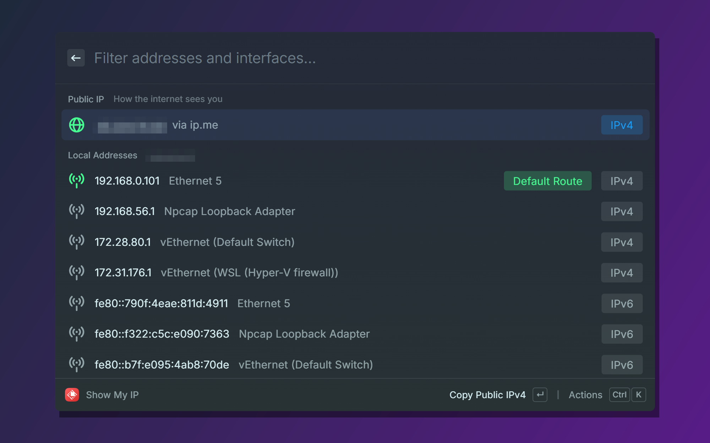
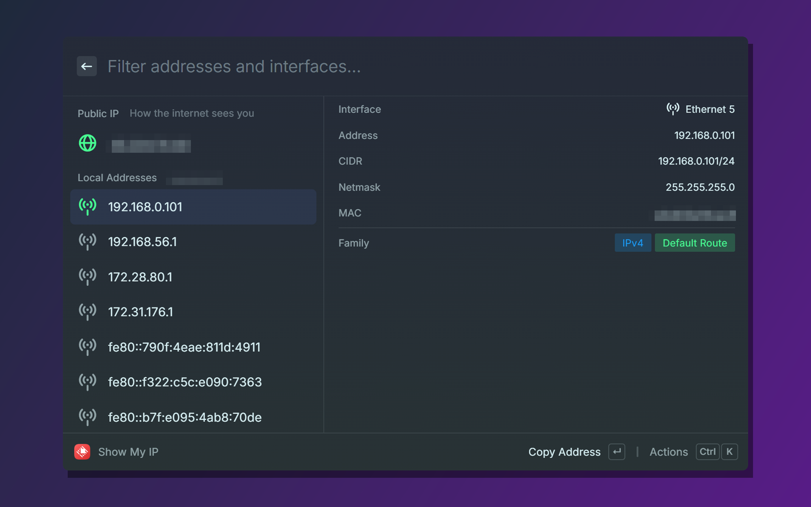
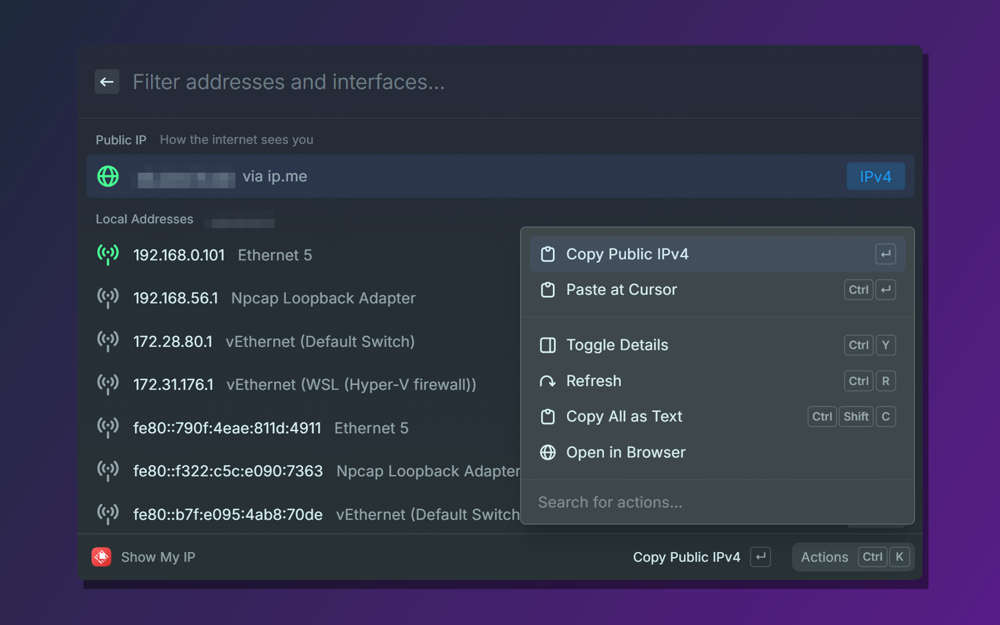

# IP Toolkit

Everything about your IP and network connection inside Raycast: public and local addresses, gateway, DNS and Wi-Fi, a public IP change monitor with history, WHOIS, a subnet calculator, a port scanner, a speed test and one-step public tunnels.

Works on **Windows**. No accounts, no API keys, no analytics.

## Commands

| Command | Mode | What it does |
| --- | --- | --- |
| **Show My IP** | view | Public IPv4 (optionally IPv6) cross-checked by two services, default gateway, DNS servers, Wi-Fi network, running tunnels and every local interface address. |
| **Copy My IP** | no-view | Copies your external or internal IP to the clipboard. Nothing opens; you only see a short confirmation. |
| **Paste My IP** | no-view | Pastes your external or internal IP at the cursor of the frontmost app (it also stays in the clipboard). |
| **Monitor Public IP** | background | Checks the public IP every 5 minutes, shows it under the command name and notifies you when it changes. |
| **Public IP History** | view | Every public IP the monitor has seen, with when it appeared and how long it lasted. |
| **Whois Lookup** | view | Owner, network range, abuse contact and registration dates of an IP, domain or AS number (RDAP). |
| **Subnet Calculator** | view | Network, broadcast, host range, netmask, wildcard and host count for IPv4 and IPv6. |
| **Port Scan** | view | Checks which TCP ports are open on a host you own or are allowed to test. |
| **Speed Test** | view | Latency, download and upload speed using Cloudflare's speed test servers. |
| **Manage Tunnels** | view | Shows running cloudflared and ngrok tunnels and exposes a local port with a temporary public URL. |

### Show My IP

- **Public IP**: the address the internet sees. Two services are asked at the same time:
  - **✓ Confirmed** (green): two independent services returned the same address.
  - **⚠ Mismatch** (orange): the services disagree, which usually means several internet links, load-balanced NAT or a proxy.
  - **Single Source**: only one service answered.
  - **VPN?**: the default route goes through an adapter that looks like a VPN (WireGuard, OpenVPN, Tailscale and similar).
- **Network**: default gateway, DNS servers, connected Wi-Fi network with signal, and cloudflared or ngrok processes that are running.
- **Local Addresses**: every non-loopback interface, IPv4 first. The address that currently reaches the internet is tagged **Default Route**.
- Actions: copy and paste any value, `Whois Lookup` on the public IP, `Copy CIDR`, `Copy MAC Address`, `Copy All as Text`, `Toggle Details`, `Refresh`, `Open in Browser`.

### Copy My IP and Paste My IP

Both commands take an optional **External / Internal** argument (default: External). Type the command, press Tab to pick the scope, then Enter.

- **External**: the public address the internet sees.
- **Internal**: the local address of the interface holding the default route; if it cannot be detected, the first non-loopback (and, for IPv6, non-link-local) address.

Paste My IP closes Raycast first so the address lands in the app that was in front; if pasting fails, the IP is still in the clipboard and the confirmation says so. Assign hotkeys or aliases in Raycast settings for one-keystroke access.

### Monitor Public IP and Public IP History

Run **Monitor Public IP** once to turn it on. From then on Raycast runs it in the background every 5 minutes. The current IP and the time of the last check appear under the command name in the root search, and a notification appears when the address changes. Disable the command in Raycast settings to stop monitoring.

**Public IP History** lists the last 100 addresses, with the current one on top. Each entry has `Copy IP` and `Whois Lookup`. `Check Now` records the current IP immediately and `Clear History` deletes everything.

### Whois Lookup

Type an IP address, a domain or an AS number (`AS15169` or `15169`) as the argument. With no argument it looks up your public IPv4. The query goes to [rdap.org](https://rdap.org), which forwards it to the registry responsible for the record (ARIN, RIPE, LACNIC, Registro.br, Verisign and others).

### Subnet Calculator

Type an address with a prefix (`192.168.0.10/24`, `2001:db8::/48`) or with a netmask (`10.0.0.1 255.255.255.252`). With an empty search bar it shows the subnet of your default-route address. Each value can be copied or pasted, and `Copy All` copies the whole result.

### Port Scan

Pick a host (default `127.0.0.1`), a port preset (common ports, 1-1024 or a custom list such as `22,80,443,8000-8100`) and a timeout. Up to 1024 ports are checked, 64 at a time, with a plain TCP connect: a port is **open** when the connection is accepted, **closed** when it is refused and **filtered** when there is no answer before the timeout.

Only scan hosts you own or are authorized to test.

### Speed Test

Measures latency (median of 10 requests) and jitter (average difference between consecutive requests), then downloads 25 MB and uploads 5 MB through `speed.cloudflare.com`. Speeds are shown in Mbps (1 Mbps = 1,000,000 bits per second, the unit internet plans are sold in) and in MB/s (Mbps ÷ 8, what browsers show while downloading). It is a quick single-connection estimate, so latency, jitter and caching along the path affect the result. The test uses about 30 MB of data.

### Manage Tunnels

- **Active Tunnels**: tunnels started from this command, tunnels reported by a local ngrok agent, and cloudflared or ngrok processes started elsewhere (for example a cloudflared Windows service).
- **Start a Tunnel**: type a local port, confirm, and the public URL is copied to the clipboard.
  - **cloudflared** creates a temporary `trycloudflare.com` address. No account is needed and the URL changes every time.
  - **ngrok** uses your ngrok account. Run `ngrok config add-authtoken <token>` once before the first tunnel.
- If a tool is missing, the command offers the official installer, the download page and the `winget install` command. Nothing is downloaded or installed automatically.
- Anyone with the URL can reach the exposed port while the tunnel runs. Use `Stop Tunnel` to close it.

## Preferences

| Command | Preference | Default | Description |
| --- | --- | --- | --- |
| Show My IP | Public IPv6 | off | Also look up the public IPv6 address. Keep it off on networks without IPv6 so the list opens faster. |
| Copy My IP | IP Version | IPv4 | Which address family to copy. |
| Paste My IP | IP Version | IPv4 | Which address family to paste. |

## How it works

- **Public IP** comes from `ip.me`, `ip4only.me`, `api.ipify.org` and `checkip.amazonaws.com` for IPv4, and `ip.me`, `ip6only.me`, `api6.ipify.org` and `ipv6.icanhazip.com` for IPv6. Show My IP asks them in parallel and stops as soon as two agree; Copy My IP, Paste My IP and the monitor take the first valid answer. Each service gets at most 4 seconds, the whole lookup at most 10 seconds, and connections are pinned to the IP family being looked up.
- **Local addresses** come from Node's `os.networkInterfaces()`. The default-route address is found by connecting a UDP socket towards a public resolver and reading which local address Windows picked. No packet is sent.
- **Gateway and DNS** come from the PowerShell cmdlets `Get-NetRoute` and `Get-DnsClientServerAddress`, **Wi-Fi** from `netsh wlan show interfaces`, and **running tunnels** from `tasklist`. These take about a second, so this part of the list fills in after the local addresses.

### Privacy

- Public IP lookups, WHOIS queries and the speed test send HTTPS requests to the services named above, which see your public IP and standard request metadata.
- Port Scan only connects to the host you type. Manage Tunnels starts cloudflared or ngrok on your computer, which connect to Cloudflare or ngrok.
- The public IP history and the list of tunnels started from Manage Tunnels are stored in Raycast's local storage on your computer. Tunnel logs are written to the extension's support folder.
- The extension sends no analytics.

## License

MIT
